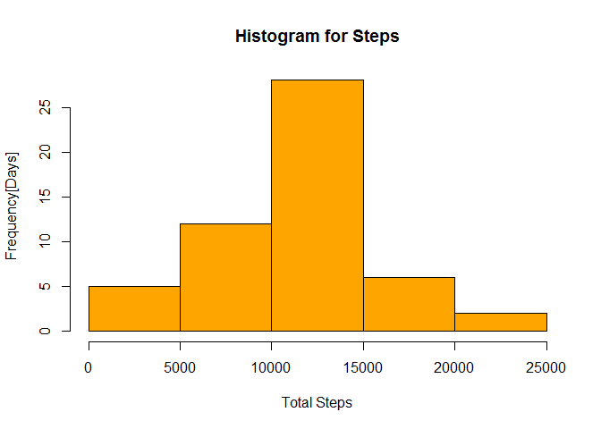
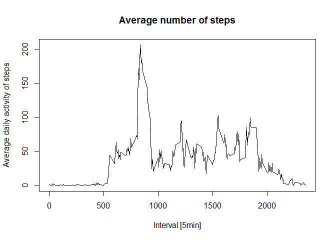
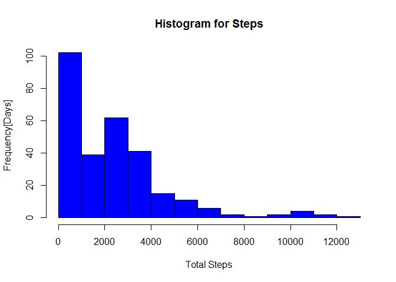

# Reproducible Research: Peer Assessment 1
This assignment makes use of data from a personal activity monitoring device. This device 
collects data at 5 minute intervals through out the day. The data consists of two months 
of data from an anonymous individual collected during the months of October and November, 
2012 and include the number of steps taken in 5 minute intervals each day.

## Loading and preprocessing the data

This code assumes that you have downloaded the data zip file and have set your working 
directory accordingly. Load the data and view the data frame structure


```r
# Check if the data has been loaded and load if it has not.
if(!file.exists("activity.csv")){
        unzip("activity.zip")
}
activityData <- read.csv("./activity.csv",header=TRUE)
str(activityData)
```

```
## 'data.frame':	17568 obs. of  3 variables:
##  $ steps   : int  NA NA NA NA NA NA NA NA NA NA ...
##  $ date    : Factor w/ 61 levels "2012-10-01","2012-10-02",..: 1 1 1 1 1 1 1 1 1 1 ...
##  $ interval: int  0 5 10 15 20 25 30 35 40 45 ...
```


## What is mean total number of steps taken per day? 

1. Make a histogram of the total number of steps taken each day  

The following code generates a aggregate data frame of the daily sum for the total steps 
taken each day.  It then generates a histogram of the total number of steps taken each 
day.


```r
aggSumStepsByDay <- aggregate(steps ~ date, activityData, sum)

hist(aggSumStepsByDay$steps, 
     xlab="Total Steps", 
     ylab="Frequency[Days]",
     main="Histogram for Steps",
     col='orange')
```

<!-- -->

2. Calculate and report the **mean** and **median** total number of steps taken per day


```r
mean(aggSumStepsByDay$steps)
```

```
## [1] 10766.19
```

```r
median(aggSumStepsByDay$steps)
```

```
## [1] 10765
```

## What is the average daily activity pattern?

1. Make a time series plot (i.e. type = "l") of the 5-minute interval (x-axis) and the 
average number of steps taken, averaged across all days (y-axis)  

The following code aggregates the steps per interval and calculates the mean for 
each interval. The calculated mean value is then plotted as a time series.


```r
aggMeanStepsByInterval <- aggregate(steps ~ interval, activityData, mean)
plot(aggMeanStepsByInterval, 
     type="l",
     xlab="Interval [5min]",
     ylab="Average daily activity of steps",
     main="Average number of steps")
```

<!-- -->

2. Which 5-minute interval, on average across all the days in the dataset, contains the 
maximum number of steps?


```r
aggMeanStepsByInterval$interval[which.max(aggMeanStepsByInterval$steps)]
```

```
## [1] 835
```

## Imputing missing values

There are a number of days/intervals where there are missing values (coded as NA). 
The presence of missing days may introduce bias into some calculations or summaries of 
the data.  

1. Calculate and report the total number of missing values in the dataset (i.e. the total 
number of rows with NAs)


```r
sum(is.na(activityData$steps))
```

```
## [1] 2304
```

2. Devise a strategy for filling in all of the missing values in the dataset. The strategy 
does not need to be sophisticated. For example, you could use the mean/median for that 
day, or the mean for that 5-minute interval, etc.  

Since mean is already calculated for each interval and represented as another variable, we 
will use the mean of the steps for the 05 minute interval.  

3. Create a new dataset that is equal to the original dataset but with the missing data 
filled in.  

The following code creates a new data frame **activityfull** which will replace all NA's
in the step column with the mean of steps for the 05 minute interval.


```r
activityFull <- activityData 
for (i in 1:nrow(activityFull)) {
    if (is.na(activityFull$steps[i])) {
        activityFull$steps[i] <- aggMeanStepsByInterval[which(activityFull$interval[i] == aggMeanStepsByInterval$interval), ]$steps
    }
}
sum(is.na(activityFull$steps))
```

```
## [1] 0
```

```r
str(activityFull)
```

```
## 'data.frame':	17568 obs. of  3 variables:
##  $ steps   : num  1.717 0.3396 0.1321 0.1509 0.0755 ...
##  $ date    : Factor w/ 61 levels "2012-10-01","2012-10-02",..: 1 1 1 1 1 1 1 1 1 1 ...
##  $ interval: int  0 5 10 15 20 25 30 35 40 45 ...
```

4. Make a histogram of the total number of steps taken each day and Calculate and report 
the mean and median total number of steps taken per day. Do these values differ from the 
estimates from the first part of the assignment? What is the impact of imputing missing 
data on the estimates of the total daily number of steps?  

To be able to plot the histogram we will need to recalculate the aggregation of steps.


```r
aggNewSumStepsByDay <- aggregate(steps ~ interval, activityFull, sum)

hist(aggNewSumStepsByDay$steps, 
     xlab="Total Steps", 
     ylab="Frequency[Days]",
     main="Histogram for Steps",
     col='blue')
```

<!-- -->

Recalculated mean and median for the total number of steps


```r
mean(aggNewSumStepsByDay$steps)
```

```
## [1] 2280.339
```

```r
median(aggNewSumStepsByDay$steps)
```

```
## [1] 2080.906
```

**Analysis:** We can note that the impact of adding the missing data as a mean of the date 
for the interval skewed the histogram to show that there are much more intervals with steps
in the 0 - 4000 range than the other ranges.  

## Are there differences in activity patterns between weekdays and weekends?  

1. Create a new factor variable in the dataset with two levels - "weekday" and "weekend" 
indicating whether a given date is a weekday or weekend day.  

Add the day type factor to the new full data list using the **weekdays** function to 
detirming which day is a weekday or a weekend date. We then loop through the data frame 
using the subset on each day type.  Plot for each day type after setting the media output
to one column by two rows for the plot.  

```r
v_weekdays <- c('Monday', 'Tuesday', 'Wednesday', 'Thursday', 'Friday')
activityFull$daytype <- factor((weekdays(as.Date(activityFull$date)) %in% v_weekdays),
                             levels=c(FALSE, TRUE), labels=c('weekend', 'weekday'))                          

par(mfrow=c(2,1))
for (type in c("weekend", "weekday")) {
    aggMeanByDayType <- aggregate(steps ~ interval,
                            data=activityFull,
                            subset=activityFull$daytype==type,
                            FUN=mean)
    plot(aggMeanByDayType, type="l", main=type)
}
```

<!-- -->
